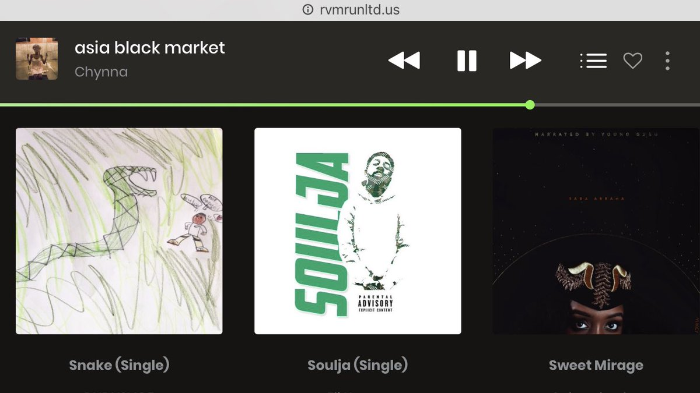
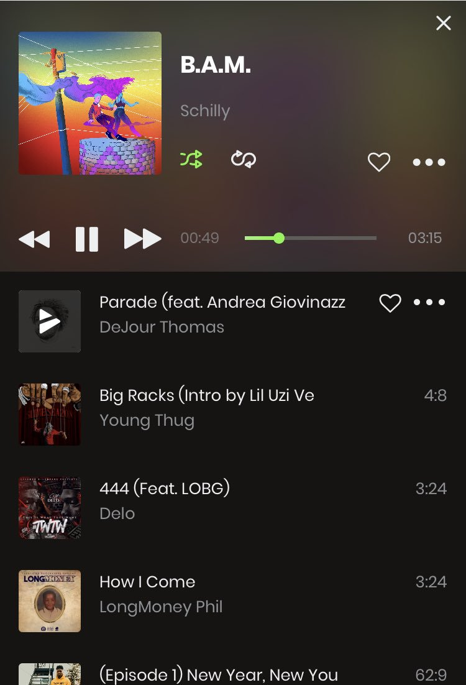

# .UNLTD streaming demo
> A demo I created for a local startup whom was entering the Harbor Entrepreneur Center. 

This was a demo application that was thrown together for a local startup to present their idea. I used the LAMP stack along side with docker for local dev work. The site was deployed but taken down shortly after presenting. This was a music app that had full functionality to upload, download, and play music. Artists could create their own page and recieve "tips" via paypal for the work they did, similar to that of Twitch Streaming. 

## Meta

Brendan Giberson – bgibers@g.clemson.edu

Distributed under the MIT license. See ``LICENSE`` for more information.

[https://github.com/bgibers/](https://github.com/bgibers/)
[https://rvmrunltd.us](https://rvmrunltd.us)
